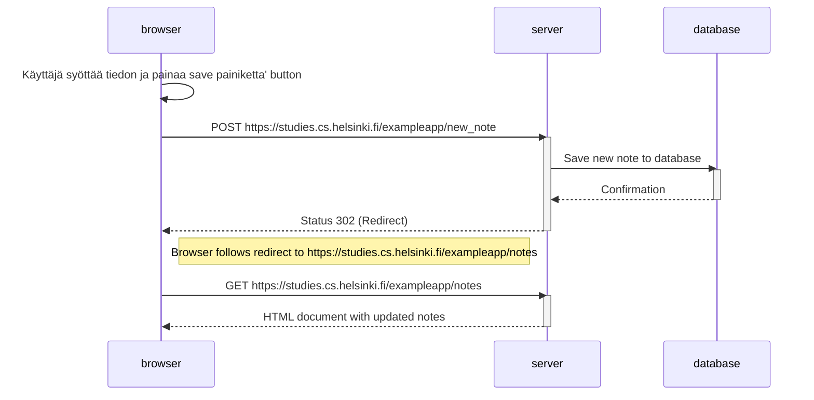

```mermaid
sequenceDiagram
    participant browser
    participant server
    participant database
    
    browser->>browser: Käyttäjä syöttää tiedon ja painaa save painiketta' button
    
    browser->>server: POST https://studies.cs.helsinki.fi/exampleapp/new_note
    activate server
    server->>database: Save new note to database
    activate database
    database-->>server: Confirmation
    deactivate database
    server-->>browser: Status 302 (Redirect)
    deactivate server
    
    Note right of browser: Browser follows redirect to https://studies.cs.helsinki.fi/exampleapp/notes
    
    browser->>server: GET https://studies.cs.helsinki.fi/exampleapp/notes
    activate server
    server-->>browser: HTML document with updated notes
    deactivate server
```
