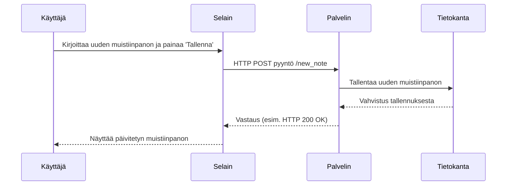

```mermaid
sequenceDiagram
    participant Käyttäjä
    participant Selain
    participant Palvelin
    participant Tietokanta

    Käyttäjä->>Selain: Kirjoittaa uuden muistiinpanon ja painaa 'Tallenna'
    Selain->>Palvelin: HTTP POST pyyntö /new_note
    Palvelin->>Tietokanta: Tallentaa uuden muistiinpanon
    Tietokanta-->>Palvelin: Vahvistus tallennuksesta
    Palvelin-->>Selain: Vastaus (esim. HTTP 200 OK)
    Selain-->>Käyttäjä: Näyttää päivitetyn muistiinpanon
```
